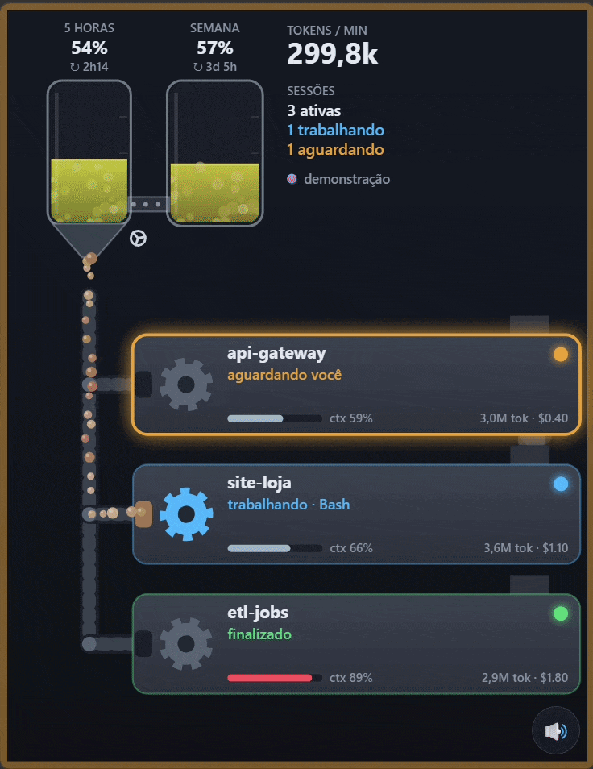

# AIdashboard

Painel animado em tempo real das sessões do Claude Code, visto no celular pela rede Wi-Fi local.

<p align="center">
  
</p>

- **Tubos**: limite de 5 horas e limite semanal do plano (Pro/Max). As pedras saem do tubo de 5h.
- **Pedras na esteira**: tokens consumidos; a velocidade da esteira acompanha os tokens por minuto.
- **Máquinas**: uma por sessão do Claude Code, mostrando o estado (trabalhando, aguardando você,
  finalizado, compactando, erro), a ferramenta em uso, o contexto ocupado, os tokens e o custo.
- **Sons e vibração** quando uma sessão passa a aguardar você ou termina a resposta; a tela do
  celular fica ligada enquanto o painel está aberto.


## Como funciona

```
Claude Code ──hooks http──► 127.0.0.1:47800/hook   ─┐
            ──status line─► 127.0.0.1:47800/status ─┼─► servidor Python ── WebSocket (Wi-Fi) ──► celular
~/.claude/projects/**/*.jsonl ── watcher ───────────┘
```

| Fonte | O que fornece |
|---|---|
| Plugin com hooks `http` | estado de cada sessão (máquinas) |
| Status line | limites de 5h e semanal (tubos), contexto e custo por sessão |
| Transcripts JSONL | tokens de cada resposta (pedras e velocidade da esteira) |

Os endpoints `/hook` e `/status` só aceitam conexões da própria máquina. O celular se conecta ao
WebSocket com um token de pareamento que vai no QR code, e recebe apenas dados agregados (nunca o
texto dos prompts).

## Instalação

Requer Python 3.10+ e o Claude Code instalado.

```bash
uv tool install .          # ou: pipx install .
aidashboard install        # instala o plugin de hooks e configura a status line
aidashboard                # inicia o servidor e mostra o QR code
```

No celular (mesma rede Wi-Fi), escaneie o QR code e toque em **Toque para iniciar**. Para ver o QR
code de novo, abra `http://127.0.0.1:47800/pair` no PC. No Windows, permita o acesso se o
firewall perguntar (rede privada).

Para ver a animação sem o Claude Code, abra `http://<ip-do-pc>:47800/?demo`.

### O que o `aidashboard install` altera

1. Gera um marketplace local em `~/.aidashboard/marketplace` e instala o plugin
   `aidashboard@aidashboard-local` (`claude plugin install`). Os hooks ficam no plugin, não no seu
   `settings.json`, e podem ser desativados com `/plugin`.
2. Configura a `statusLine` em `~/.claude/settings.json`, porque plugins não podem fazer isso. Antes,
   cria um backup `settings.json.aidashboard-<data>.bak`. Se você já tinha uma status line, ela
   continua aparecendo: o comando do AIdashboard repassa os dados ao painel e exibe a sua.

`aidashboard uninstall` remove o plugin e restaura a status line original.

## Limitações

- Os limites de 5h e semanal só existem para assinantes Pro/Max e só chegam depois da primeira
  resposta de uma sessão interativa. O último valor fica salvo em `~/.aidashboard/state.json`.
- A página é servida por HTTP na rede local, então a API oficial de tela ligada (Wake Lock) não está
  disponível; o painel usa o NoSleep.js (vídeo mudo em loop) como alternativa.
- Com a tela do celular apagada ou o navegador em segundo plano, a página fica suspensa e não toca
  sons; ao voltar, ela reconecta e atualiza o estado.
- Sessões encerradas sem o evento `SessionEnd` (terminal fechado à força) somem após 4h sem
  atividade.

## Desenvolvimento

```bash
uv venv && uv pip install -e .
.venv/Scripts/python -m aidashboard          # Windows
```

Variáveis úteis: `AIDASHBOARD_HOME` (padrão `~/.aidashboard`) e `CLAUDE_CONFIG_DIR`
(padrão `~/.claude`).

## Licença

[MIT](LICENSE). Inclui o [NoSleep.js](https://github.com/richtr/NoSleep.js), também sob licença MIT.
